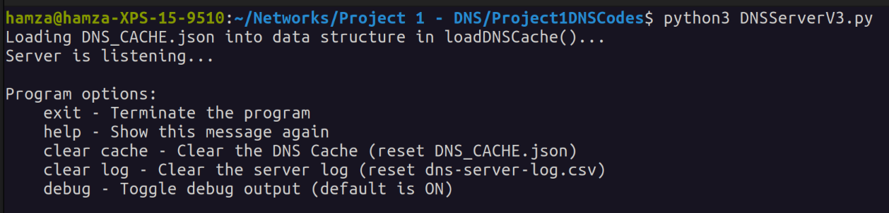
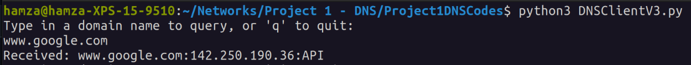

## Hamza Khan,CSCI4211S23,02/23/2023 
## Python3,DNSServerV3.py,,DNSServerV3.py

 

# CSCI 4211 Programming Project 1: Simple DNS Server
## Compilation
All code here is written using Python3, thus no compilation is required.

## Usage
To use the code on a Linux machine (tested on Ubuntu), follow these steps:  
1. Clone this respository using `git clone` or download it as you like.
2. Navigate to the location of the `Project1DNSCodes` folder in the respository.
3. Start the server first using command `python3 DNSServerv3.py` in your terminal.
4. Open another new terminal to the same folder and Start the client program using `python3 DNSClientV3.py`

If the connection is successful on the server side, you should see something like this 

On the client side, expect something like this. You are free to then send a domain name such as `www.google.com` and the server will send back a response as similar to this. 

# Implementation Details
## Server Program flow
The server takes the following steps:
1. First, load the DNS Cache into a dictionary using `loadDNSCache()`.
2. Begin the `main()` loop. The main loop does the following:
    - Initialize a TCP, IPv4 socket on `port 9889` with `hostname "localhost"`
    - Begin a "monitor" thread which listens for exit from the user to terminate the program.
    - Continuously wait for clients to connect, then initialize a thread with `dnsQuery()` as the target function for each.
3. Upon program termination, two files will have been created if they did not exist previously: DNS_MAPPING.txt, and dns-server-log.csv
    - If these files already existed when the program was running, they have been updated with any new queries.

## Server Functions
`debugMsg(msg: str, indent: bool = False) -> None` - Log a msg to the console. If indent is true, add an indent to the text.

`displayHelpMessage() -> None` - Show all available commands when the user types help.

`dnsQuery(connectionSock: socket, srcAddress: Tuple[str, str]) -> None` - Given a connection socket to a client, wait to receive a domainName from them, query the local DNS cache and local DNS server (if necessary), and send the ip address back to the client via sockets. Updates the cache and server logs as necessary. This function will close the connectionSock.

`dnsSelection(ipList: List[str]) -> str` - Given a list of ip addresses, return the best one, determined by ping latency.

`getPingLatency(ip: str) -> float` - Given an ip address, ping it, and return the latency in ms.

`monitorQuit() -> None:` - This is the thread checking user input on the server. Handle all appropriate commands shown by `displayHelpMessage()`.

`loadDNSCache() -> None` - Load the DNS_CACHE global variable with the contents of the DNS_MAPPING.txt file. Each line in the file is as follows: `hostname ipaddr1,ipaddr2,...`

`updateDNSCache(indentDebugMsg: bool = False) -> None` - Update the DNS_CACHE file with the up to date DNS_CACHE global variable. Call this before exiting the program. When indentDebugMsg is true, debugMsg will be called with(..., indent=True)

`clearFile(filename: str) -> None` - Reset the file specified by filename.

`updateServerLog(hostname: str, answer: str, resolution: str) -> None` - Update the server log file in the following format: `www.google.com,172.217.0.164,API`

## Client Program Flow
1. Create an IPv4 TCP socket on "localhost" and port 9889, same as the server.
2. Continuously take user input. They are meant to type domain names to query.
3. Send the string to the server, and print the response in the terminal.

## Client Functions
All of this is accomplished in the `main()` loop.