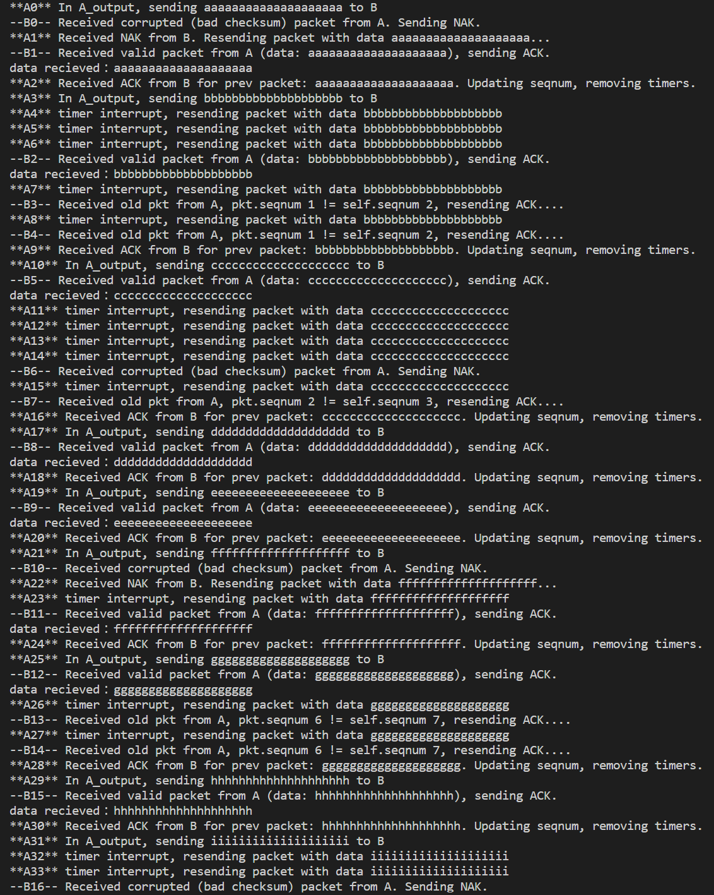
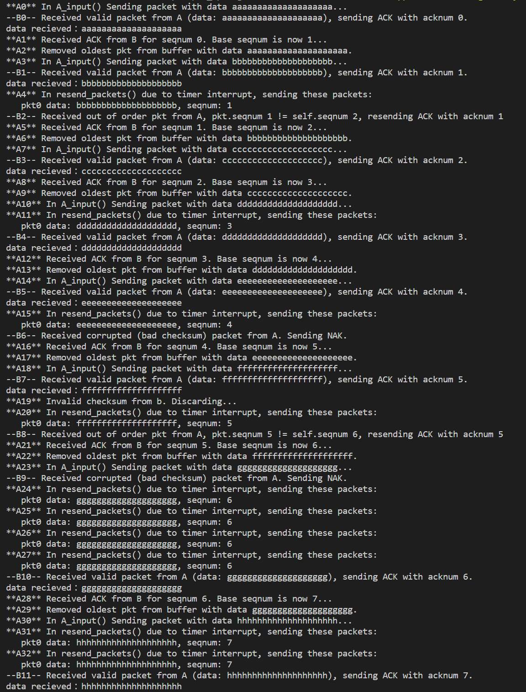
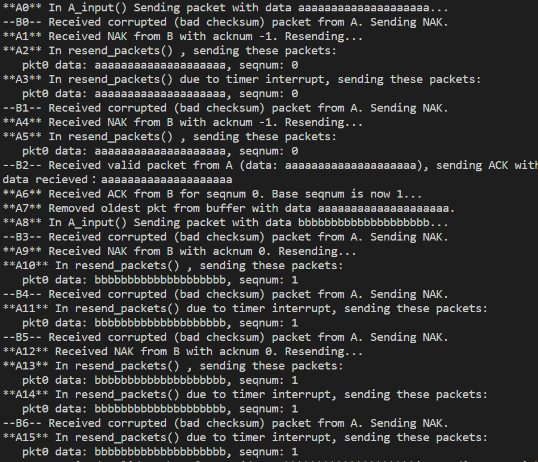
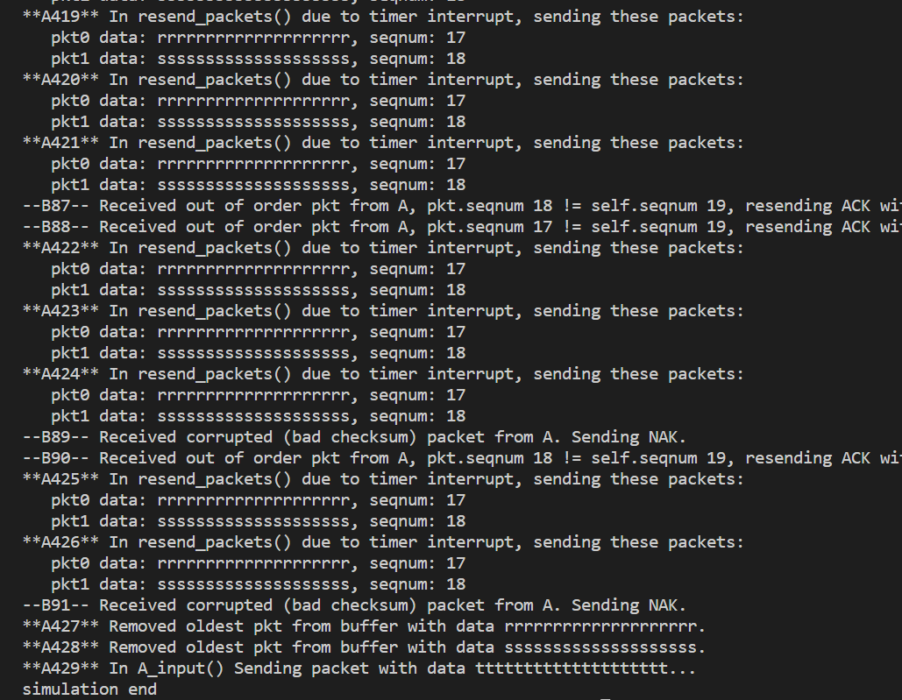

## Hamza Khan,CSCI4211S23,03/17/2023
## Python3,main.py,,main.py

</br>

# CSCI 4211 Programming Project 2: Reliable Data Transfer
## Compilation
All code here is written using Python3. No compilation is required. Make sure you have [python installed](https://www.python.org/downloads/).


## Usage
The code should work on both Windows and Linux. To use it, follow these steps:
1. Clone this respository using `git clone` or download it as you like.
2. Enter either the `go_back_n` or `stop_and_wait` folders and run their main.py script (see the `file hierarchy` below).
    Then you can run the program using `python3 main.py` or `python main.py` depending on your python install.


## File Hierarchy
```
project2/
    ├── README.md
    ├── stop_and_wait/
    │   ├── pj2/
    │   │   ├── __init__.py (allow the modules to be importable)
    │   │   ├── A.py (sender logic)
    │   │   ├── B.py (receiver logic)
    │   │   ├── circular_buffer.py (circular buffer, used in go_back_n)
    │   │   ├── event_list.py (linked list maintaining simulation events in order)
    │   │   ├── event.py (the class for each node in event_list)
    │   │   ├── msg.py (the class for each message sent in every packet)
    │   │   ├── packet.py (the class for packets, used for transfer between A and B)
    │   │   └── simulator.py
    │   └── main.py
    └── go_back_n/
        ├── pj2/
        │   ├── __init__.py
        │   ├── A.py
        │   ├── B.py
        │   ├── circular_buffer.py
        │   ├── event_list.py
        │   ├── event.py
        │   ├── msg.py
        │   ├── packet.py
        │   └── simulator.py
        └── main.py
```

# Stop and Wait Implementation Description
## Note that all code is sufficiently commented as well and this summarizes the comments.
## B.py (stop and wait receiver side) functions
**NOTE**: If you wish to display debug messages for B.py, change `b = B()` to `b = B(debug_msgs=True)`
`B_input(self, pkt: packet)`:
1. Verify the packet's checksum (send NAK if bad).
2. Verify the packet's sequence number (resend most recent ACK if packet's seqnum is old).
3. Accept the packet, ACK it, and send the data to the application side.

`B_send_nak(self)`:
- Send a NAK packet to A via layer 3 (indicated with the packet's acknum == self.seqnum - 1).

`show_debug_msg(self, message: str)`:
- Print debug messages to the console if `debug_msgs=True` in B's constructor.

## A.py (stop and wait sender side) functions
**NOTE**: If you wish to display debug messages for A.py, change `a = A()` to `a = A(debug_msgs=True)`
`A_input(self, pkt: packet)`:
1. Verify B's packet's checksum (resend the previous packet if it's bad).
2. See if we received an ACK for the packet we just send. If so, remove any timers and update sequence number.
3. See if we receive a NAK instead. If so, resend the previous packet again.

`A_output(self, m: msg)`:
1. Create a new packet and set it as the "pkt_wait_for_ack".
2. Send the packet and start a timer for handle the timeout.

`send_packet_and_restart_timers(self, pkt: packet)`:
- Deactivate any old timers, send the packet via `to_layer_3()`, then start a timer.

`A_handle_timer(self)`:
- Resend `pkt_waiting_for_ack` and restart the timer.

`show_debug_msg(self, message: str)`:
- Print debug messages to the console if `debug_msgs=True` in A's constructor.


# Go Back N Implementation Description
## B.py (Go Back N receiver side) is basically the same as the Stop and Wait code.
**NOTE**: If you wish to display debug messages for B.py, change `b = B()` to `b = B(debug_msgs=True)`

## A.py (Go Back N sender side) functions
**NOTE**: If you wish to display debug messages for A.py, change `a = A()` to `a = A(debug_msgs=True)`
`A_output(self, m: msg)`:
- Send a packet to B and update the sender buffer. Drop the packet if buffer is full.

`A_input(self, pkt: packet)`: 
- Receive a packet from B, verify it. Resend old packets and update the buffer accordingly depending on pkt.acknum. See the code comments and debug messages for a more detailed description.

`A_handle_timer(self)`:
- Read all the sent packets that have not been acknowledged in circular buffer and resend them.

`resend_packets(self, timer_interrupt: bool = False)`:
- Resend all packets in the buffer in order to B. If timer_interrupt is True, mention that in the debug msg that's printed.

`pop_oldest_buffer_item(self) -> packet`:
- Get the oldest item in the circular buffer. It is popped from the buffer.

`show_debug_msg(self, message: str)`:
- Print the message to the screen if self.debug_msgs is True (and increment self.dbg_num) else do nothing.

# Evaluation
To evaluate program functionality, extensive debug logging is performed. To enable this, simply use the option keyword only argument "debug_msgs=True" in A and B's constructors like: `a = A(debug_msgs=True)`. All logical operations can be traced in order.

### **Below shows the stop_and_wait debug output:**
As is evident below, all events in program execution are visible and list their reason for occurring. We can see how corrupted packets or dropped packets are handled.



### **Below shows the go_back_n debug output with standard simulation parameters:**
Observe below how corrupted packets or dropped packets are handled. We can see when packets are resent or removed from the buffer as well, and when out of order packets are received in B.


### **Below shows the go_back_n debug output with corruption probability of 0.6 (default is 0.2):**
With a high corruption probability, more packets are ignored or NAK'd as shown in the debug output. A has to resend packets more often as a result.


### **Below shows the go_back_n debug output with loss probability of 0.8 (default is 0.3):**
With a very high loss probability, we have to send packets much more. The below output shows highlights this well. Notice how (rrr...) and (sss...) had to be resent many times due to the timer interrupt (since packets were lost B).

